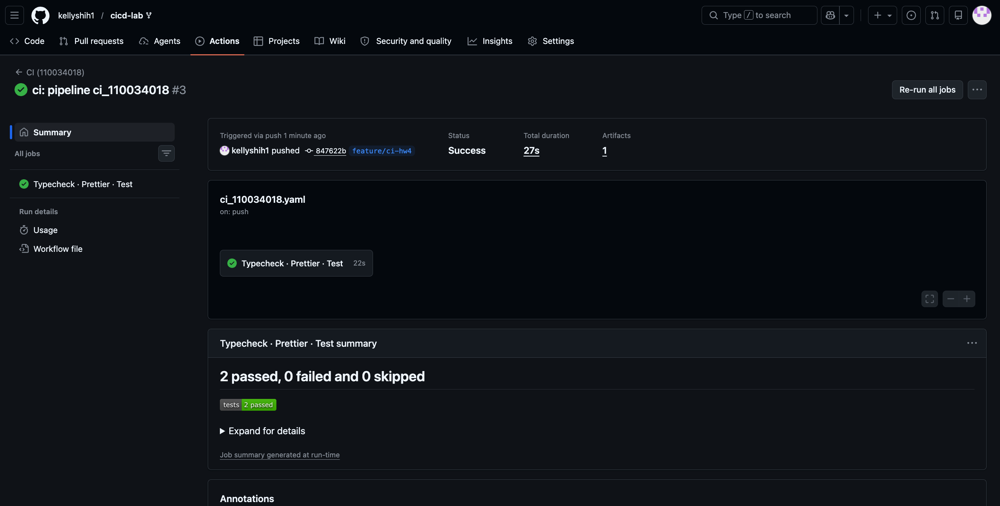
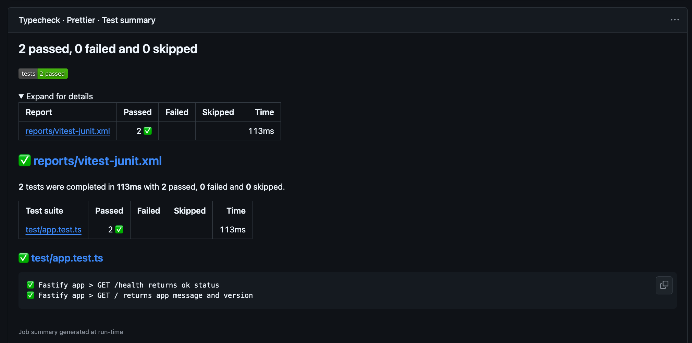
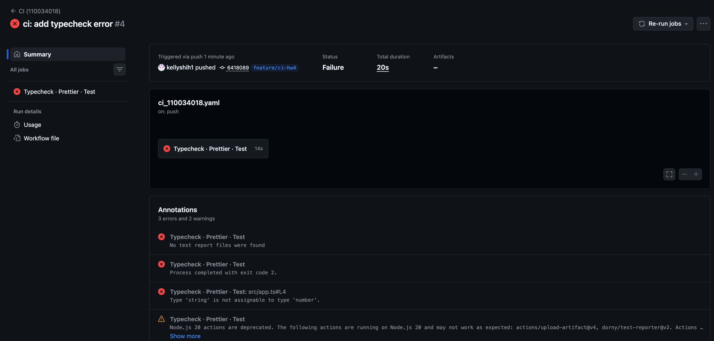
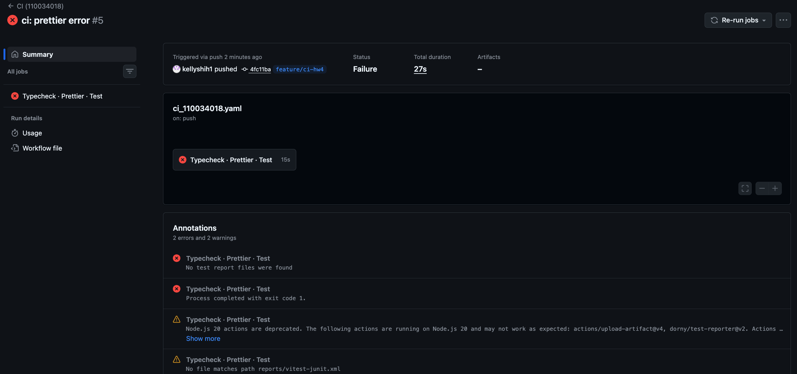
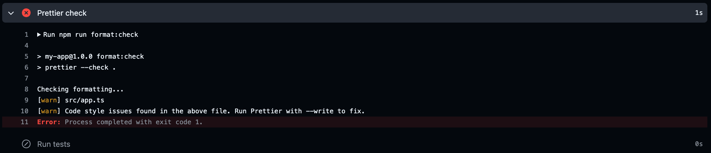
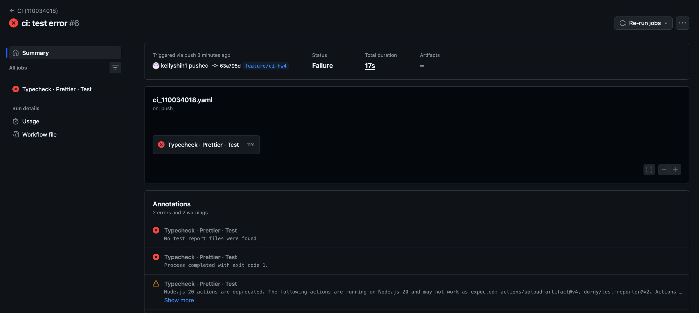

# HW4 - CI/CD

## 1. CI Pipeline 說明

本專案在 `.github/workflows/ci_110034018.yaml` 定義一條在 **push**（所有分支）與 **pull_request** 時自動執行的 CI pipeline。流程在單一 job `quality-checks` 中依序執行三項品質檢查；任一步驟以非零 exit code 結束時，整個 workflow run 會標記為 **failed**，並在 GitHub Actions 頁面顯示失敗的步驟名稱與 log。

### 設計策略

| 面向         | 作法                                                                                       |
| ------------ | ------------------------------------------------------------------------------------------ |
| 觸發條件     | `on.push` 涵蓋所有分支，確保每次推送都跑 CI                                                |
| 相依安裝     | `actions/setup-node` + `cache: npm` 搭配 `npm ci`，可重現且較快                            |
| 失敗行為     | 各檢查為獨立 step；`npm run typecheck` / `format:check` / `test` 失敗即中止 job            |
| 測試結果展示 | Vitest 輸出 JUnit XML → `dorny/test-reporter` 發佈到 GitHub Checks；另上傳 artifact 供下載 |
| 並發控制     | `concurrency` 取消同一 ref 上較舊的 run，節省 runner 時間                                  |

### 使用工具

- **GitHub Actions**：`actions/checkout@v5`、`actions/setup-node@v5`、`actions/upload-artifact@v4`
- **專案腳本**：`npm run typecheck`（`tsc --noEmit`）、`npm run format:check`（`prettier --check`）、`npm test`（Vitest）
- **dorny/test-reporter@v2**：將 JUnit 報告解析為 GitHub Actions 結果頁上的測試摘要（通過/失敗筆數、個別 testcase）

### Workflow 主要內容

```yaml
name: CI (110034018)

on:
  push:
    branches:
      - '**'
  pull_request:

permissions:
  contents: read
  checks: write

concurrency:
  group: ci-110034018-${{ github.workflow }}-${{ github.ref }}
  cancel-in-progress: true

jobs:
  quality-checks:
    name: Typecheck · Prettier · Test
    runs-on: ubuntu-latest
    steps:
      - name: Checkout
        uses: actions/checkout@v5

      - name: Setup Node.js
        uses: actions/setup-node@v5
        with:
          node-version: '22'
          cache: npm

      - name: Install dependencies
        run: npm ci

      - name: TypeScript typecheck
        run: npm run typecheck

      - name: Prettier check
        run: npm run format:check

      - name: Run tests
        id: tests
        continue-on-error: true
        run: |
          npm test -- --reporter=default --reporter=junit --outputFile.junit=junit.xml

      - name: Publish test results
        uses: dorny/test-reporter@v2
        if: success() || failure()
        with:
          name: Vitest Test Results
          path: junit.xml
          reporter: java-junit
          fail-on-error: true

      - name: Fail if tests failed
        if: steps.tests.outcome == 'failure'
        run: exit 1

      - name: Upload test report artifact
        if: always()
        uses: actions/upload-artifact@v4
        with:
          name: test-report-${{ github.run_id }}
          path: junit.xml
          if-no-files-found: ignore
```

### 各步驟說明

1. **TypeScript typecheck**：執行 `tsc --noEmit`，僅做型別檢查不產出 `dist/`，在編譯前攔截型別錯誤。
2. **Prettier check**：執行 `prettier --check .`，確保程式碼格式一致；與 `npm run format`（write）區分，CI 只驗證不修改檔案。
3. **Run tests**：Vitest 輸出 `junit.xml` 至專案根目錄（**不可**放在 `.gitignore` 的 `reports/` 內，否則 test-reporter 找不到檔案）。
4. **Publish test results**：`dorny/test-reporter` 只會掃描 **git 未忽略** 的檔案，讀取 `junit.xml` 並在 Checks 顯示通過/失敗的 testcase。
5. **Fail if tests failed**：測試失敗時仍先發佈報告，再由此步驟讓 workflow 標記為 failed。
6. **Upload artifact**：可從 Artifacts 下載 `junit.xml` 除錯。

---

## 2. CI 執行結果截圖

### 成功執行範例


_說明：workflow 顯示綠色勾號，job `Typecheck · Prettier · Test` 全部步驟通過。_



_說明：展開 **Publish test results** 或 repo **Checks** 中的 `Vitest Test Results`，可見 2 passed tests。_

### 本機驗證指令（推送前）

```bash
cd cicd-lab
npm ci
npm run typecheck
npm run format:check
npm test -- --reporter=default --reporter=junit --outputFile.junit=junit.xml
```

亦可使用 `act push -W .github/workflows/ci_110034018.yaml` 在本機模擬（需已安裝 [act](https://github.com/nektos/act)）。

---

## 3. 失敗案例說明

以下三種錯誤可**分別**引入以觀察 pipeline 失敗；修復後再 push 應恢復成功。

### 案例 A：TypeScript 型別錯誤

**引入方式**（`src/app.ts` 暫時加入）：

```typescript
const broken: number = 'not-a-number';
```

**失敗現象**：`TypeScript typecheck` 步驟失敗，log 顯示 `Type 'string' is not assignable to type 'number'`。



**修復**：刪除或修正該行，使 `npm run typecheck` 通過後 commit & push。

---

### 案例 B：Prettier 格式錯誤

本專案 `.prettierrc` 設定為：`singleQuote: true`、`semi: true`、`trailingComma: "none"`。以下以 `src/app.ts` 為例，故意違反這些規則。

#### 修改前（正確格式）

```typescript
import Fastify, { FastifyServerOptions } from 'fastify';

export function buildApp(options: FastifyServerOptions = {}) {
  const app = Fastify({
    logger: options.logger ?? true,
    ...options
  });
  // ...
}
```

#### 修改後（示範錯誤）

將 `src/app.ts` 開頭改成：

```typescript
import Fastify, { FastifyServerOptions } from "fastify"

export function buildApp(options: FastifyServerOptions = {}) {
    const app = Fastify({
        logger: options.logger ?? true,
        ...options,
    })
```

#### GitHub Actions 畫面





#### 修復

```bash
npm run format          # 自動修正 src/app.ts
npm run format:check    # 確認通過
git add src/app.ts
git commit -m "fix: restore prettier formatting"
git push
```

修復後 `src/app.ts` 會還原為單引號、分號、2 空格縮排、無尾隨逗號的格式。

---

### 案例 C：測試失敗

#### 引入方式

在 `test/app.test.ts` 第 12 行暫時改為：

```typescript
expect(response.statusCode).toBe(500); // 故意錯誤，正確應為 200
```

#### 先前問題：`No test report files were found`

若 JUnit 寫入 `reports/vitest-junit.xml`，而 `reports/` 在 `.gitignore` 中，`dorny/test-reporter` 只會掃描 **git 追蹤且未忽略** 的檔案，log 會出現：

```
Listing all files tracked by git
Error: No test report files were found
```

因此看不到 failed testcase。**解法**：改輸出至專案根目錄的 `junit.xml`（不在 `.gitignore`），並讓測試步驟 `continue-on-error: true`，先發佈報告再 `exit 1`。

#### 失敗現象（修正 workflow 後）

1. **Publish test results** 成功，Checks 顯示 `Vitest Test Results`：**1 failed, 1 passed**
2. **Fail if tests failed** 讓整個 workflow 為 **Failure**
3. `Run tests` log 仍有 Vitest 的 assertion 錯誤訊息



#### 修復

```typescript
expect(response.statusCode).toBe(200);
```

```bash
git add test/app.test.ts
git commit -m "fix: restore test expectation"
git push
```

---

## 4. 專案設定調整摘要

- 執行 `npm run format` 修正 `docker-compose.yml`、`snippets/01_hello.yaml`、`snippets/02_run-test.yaml` 的 Prettier 問題，使 `format:check` 在 CI 可通過。
- JUnit 輸出改為根目錄 `junit.xml`（勿放入 `.gitignore` 的 `reports/`，否則 test-reporter 無法讀取）；`junit.xml` 僅列於 `.prettierignore`。

---

## 5. 結論

本 CI 以 **push 自動觸發**、**typecheck / Prettier / test 三項檢查**、**步驟失敗即標記 workflow failed**、以及 **JUnit + test-reporter 在 Actions 結果頁展示測試** 滿足作業基本要求。透過故意引入並修復型別、格式與測試錯誤，可驗證 pipeline 能正確回報失敗原因，有助於在合併前維持程式碼品質。
